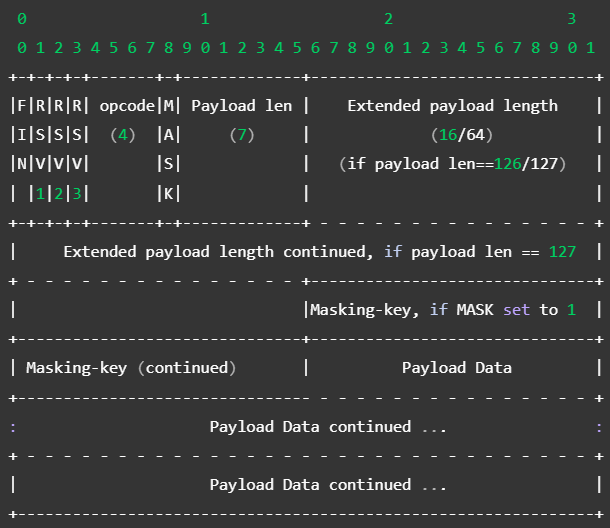

# WebSockets Overview

- A two-way (bi-directional) communication.
- Protocol - `wss://` or `ws://` (insecure)
- **Relative URL** and `https://` and `http://` schemes are allowed in **most recent browsers**.
- [Learn more] Protocol upgrade

# WebSockets Servers

- **Are often separate and specialized servers** (e.g. for load-balancing), so you will **often use a reverse proxy** (e.g. Nginx) to detect WebSocket handshakes, pre-process them, and send clients to a real WebSocket server.

## WebSockets handshake

- The handshake is the "Web" - The bridge from HTTP to WebSockets. 

### **Client** handshake request:

- Example:
  ```http
  GET /chat HTTP/1.1
  Host: example.com:8000
  Upgrade: websocket
  Connection: Upgrade
  Sec-WebSocket-Key: dGhlIHNhbXBsZSBub25jZQ==
  Sec-WebSocket-Version: 13
  ```
- Respond `403 Forbidden`, if the `Origin` header has an invalid value.
- Respond `400 Bad Request` and immediately **close the socket**, if any header is not understood or has an invalid value.
- If the server doesn't support the WebSockets version, it should send a `Sec-WebSocket-Version` response header that contains the supported version(s).
- **Note:** HTTP status codes can be used only **before the handshake**.

### **Server** handshake response:

- Example:
  ```http
  HTTP/1.1 101 Switching Protocols
  Upgrade: websocket
  Connection: Upgrade
  Sec-WebSocket-Accept: s3pPLMBiTxaQ9kYGzzhZRbK+xOo=
  ```
- A special response that indicates that the protocol will be changing from HTTP to WebSocket.
- Server can decide on **extension/subprotocol** requests here.
- Steps to compute the `Sec-WebSocket-Accept` header:
  1. **Concatenate** the `Sec-WebSocket-Key` header and the "`258EAFA5-E914-47DA-95CA-C5AB0DC85B11`".
  2. Compute the **SHA-1 hash** of the concatenated string.
  3. Encode the hash in **base64** encoding.
- The `Sec-WebSocket-Accept` header indicates that the server supports WebSockets.
- Keeping track of clients
- The server must keep track of clients' sockets so you don't keep handshaking again with clients. The server can deny handshake requests if clients attempt too many connections.
- Keep a table of usernames or IDs along with the corresponding WebSocket.

## Exchanging data frames

- All data frames follow the same specific format.
- **Client-sent data** is masked using **XOR encryption** (with a 32-bit key).

### Format

- Frame format:
  
- The server must **disconnect** from a client if that client sends an **unmasked message**.
- **Server-sent data** is not masked.
- **RSV1-3** are for **extensions** and can be ignored.
- `opcode` field defines how to interpret the payload data:
  - `0x0` for continuation - Means the server should concatenate the  payload to the last frame.
  - `0x1` for text (UTF-8 encoded)
  - `0x2` for binary
  - `0x3` to `0x7` and `0xB` to `0xF` have no meaning.
- **FIN** (finish) bit tells whether this is the last message.

### Decoding Payload Length

- Payload length is used to determine **when to stop reading** the payload data.
- Steps to read payload length (unsigned integer):
  1. Read bits 9-15.
      - If payload len is 125 or less, then that's it.
      - If payload len is 126, go to step 2.
      - If payload len is 127, go to step 3.
  2. Read the next 16 bits.
  3. Read the next 64 bits.

### Reading and unmasking the data

- MASK bit should be set.
- The next 4 octets (32 bits) is the masking key.
- To decode the payload data, loop through its bytes and XOR each byte with the `maskingKeyBytes[i % 4]`.

### Message Fragmentation

- **FIN** and **opcode** fields (1st byte) work together to send a message split up into separate frames.
- Example - How a server reacts to a client sending messages:
    ```
    Client: FIN=1, opcode=0x1, msg="hello"
    Server: (process complete message immediately) Hi.
    Client: FIN=0, opcode=0x1, msg="and a"
    Server: (listening, new message containing text started)
    Client: FIN=0, opcode=0x0, msg="happy new"
    Server: (listening, payload concatenated to previous message)
    Client: FIN=1, opcode=0x0, msg="year!"
    Server: (process complete message) Happy new year to you too!
    ```
